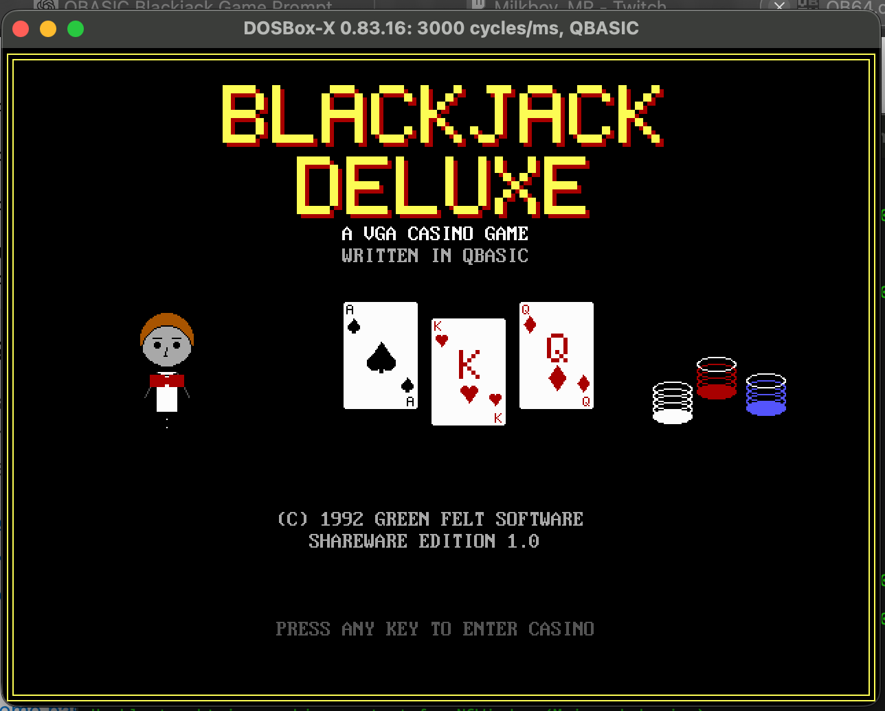
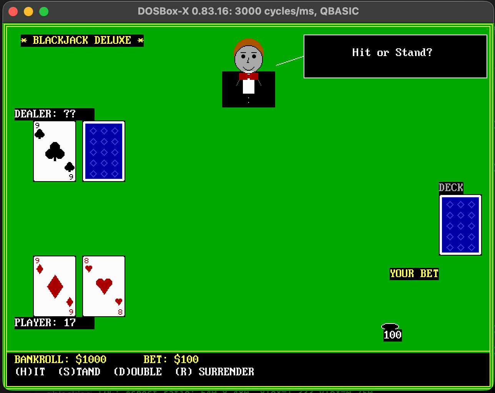

# Blackjack Deluxe VGA

A fully playable casino blackjack game written in a single file of Microsoft QBASIC 1.1, styled like commercial DOS shareware from 1992.



## Features

- **VGA graphics** — SCREEN 12 (640×480, 16 colors): green felt table, graphical playing cards with drawn suit symbols, a cartoon dealer, chip stacks, and animated dealing
- **5×7 bitmap font** — transparent custom lettering so card faces stay clean (PRINT would black out the background)
- **Full casino rules** — single 52-card deck, dealer stands on all 17, blackjack pays 3:2, double down, insurance, late surrender
- **Dealing animation** — cards slide from the deck pile across the table to their slot, and the hole card flips when revealed
- **Denomination chip display** — your bet is broken into 500/100/25/5/1 chips and drawn as a stack per denomination on the felt
- **Sound effects** — SOUND-command beeps for dealing, chips, wins, losses, busts, blackjack, and shuffling
- **Session statistics** — hands played/won/lost, pushes, peak bankroll; shown on both the cash-out and game-over screens
- **Persistent high score table** — top-5 all-time cash-outs saved to `HISCORE.DAT`; shown before the title screen and after each cash-out



*A hand in play — the dealer with his hidden hole card, graphical suited cards, the action prompt, and your wager drawn as casino chips.*

## Requirements

- **Microsoft QBASIC 1.1** (`QBASIC.EXE`) — included with MS-DOS 5 and 6, or available as a free download
- **DOSBox-X** or any compatible DOS emulator to run it on modern hardware — [dosbox-x.com](https://dosbox-x.com)

## Running

1. Mount a directory containing `QBASIC.EXE` and copy `BLACKJCK.BAS` into it (or mount them separately)
2. From the DOS prompt:

```
QBASIC.EXE /RUN BLACKJCK.BAS
```

Or open `BLACKJCK.BAS` in QBASIC interactively and press **F5**.

## How to play

| Key | Action |
|-----|--------|
| Digits + Enter | Enter your bet |
| H | Hit |
| S | Stand |
| D | Double down (first action only) |
| R | Surrender (first action only, forfeits half the bet) |
| Y / N | Accept / decline insurance when dealer shows an Ace |
| Q | Quit after a hand and see your session stats |

## Game rules

- Single 52-card deck, reshuffled when fewer than ~22 cards remain
- Dealer draws to 17, stands on all 17 (hard and soft)
- Blackjack (natural 21) pays **3:2**
- Insurance pays **2:1** (offered when dealer's upcard is an Ace)
- Double down available on any first two cards
- Late surrender available on any first two cards (returns half the bet)
- No split (single-hand only)

## Project structure

```
BLACKJCK.BAS      — complete game source (QBASIC 1.1)
HISCORE.DAT     — top-5 high score table (created on first cash-out)
screenshots/      — screenshots for this README
```

## Code structure

The source is divided into labelled sections:

| Section | Subprograms |
|---------|------------|
| Initialization | `DEFINT A-Z`, shared state, `StatsType`, `HiEntry`, main loop |
| Gameplay | `PlayHand`, `DealOne` |
| Money / UI | `GetBet`, `GetNum&`, `Settle`, `ShowStatus`, `ShowTotals`, `PromptLine`, `ClearPrompt` |
| Cards | `ShuffleDeck`, `NextCard%`, `HandValue%`, `DrawCard`, `DrawBackCard`, `DrawSuit`, `AnimateDeal`, `FlipHoleCard` |
| Graphics / Dealer | `BigLetter`, `BigText`, `DrawDealer`, `DrawChips`, `DrawBetChips`, `DrawTable`, `ClearTableArea`, `DealerSay` |
| Screens / Stats | `TitleScreen`, `GameOver%`, `FarewellScreen`, `PrintStats`, `LoadHiScores`, `SaveHiScores`, `CheckHiScore`, `ShowHiScores` |
| Utilities | `Delay`, `GetKey$`, `KeyWait%` |
| Sound | `SndDeal`, `SndChip`, `SndWin`, `SndLose`, `SndBust`, `SndBlackjack`, `SndPush`, `SndShuffle` |

## QBASIC 1.1 compatibility notes

- `DEFINT A-Z` — all undeclared variables are INTEGER; money variables use LONG (`bankroll`, `bet`, `amt&`)
- No line continuations
- No QuickBASIC 4.5-only features, no machine code, no external libraries
- `PRINT` in SCREEN 12 draws with a black cell background — card corner ranks use the custom `BigLetter` bitmap font instead to preserve the white card face
- All 44 `DECLARE` statements have matching `SUB`/`FUNCTION` definitions; `END SUB`/`END FUNCTION` counts are balanced

## License

Public domain. Do whatever you want with it.
